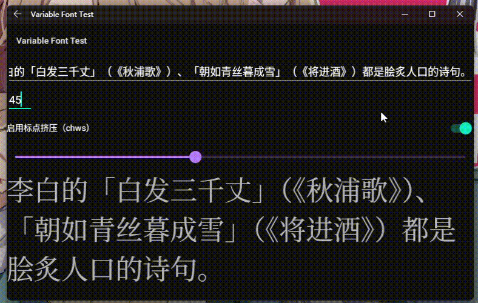

# NotoCJK

A full weight font patch for Android devices.
> NotoSansCJK full weight patch supports Android 8+  
> NotoSerifCJK full weight patch supports Android 9+  

Fonts files are provided by [noto-cjk](https://github.com/googlefonts/noto-cjk) from Google.
> The fonts have been modified using [subset_noto_cjk.py](https://android.googlesource.com/platform/external/noto-fonts/+/refs/heads/main/scripts/subset_noto_cjk.py) to remove `cmap` entries for characters that should default to the emoji style on Android.  
> The fonts have been modified using [chws_tool](https://github.com/googlefonts/chws_tool) to include a `chws` table.  
> For more details, please visit https://github.com/WordlessEcho/patch-noto-cjk-for-android  

## NOTICE
* You should use latest Magisk/KernelSU to install this module.
* For Android 15+, NotoSansCJK officially supports variable fonts but only within the weight range of 400-900. This module extends the range to 100-900.
* Recent fixes:
  * Removed old fonts that prevent MinikinFont from loading with an NPE when Magisk/KernelSU triggers unmounting.
* Known issues:
  * HK fonts style is pending & waiting for Google solution in later android versions.

## Credit & Support & Maintenance
* Currently, this module is still maintained. It was used to be stored at official repo but got removed in repo cleanup. Now you can download it directly in this repo's [release tabs](https://github.com/simonsmh/notocjk/releases). [John Wu's Twitter for details](https://twitter.com/topjohnwu/status/1229896206584664065)
* Any issue or pull request is welcomed.
* Star this module at [GitHub](https://github.com/simonsmh/notocjk).
